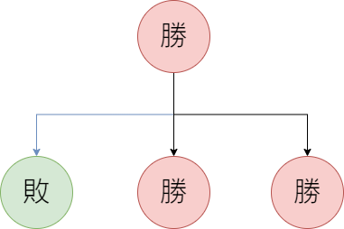
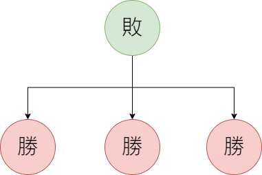

# SG值

作者: JimLin 最後編輯:2023/10/20

## 公平組合遊戲(Imparitial Game)

1. 兩人參與遊戲，輪流做出決策，且雙方皆知道遊戲完整訊息
2. 玩家做出的決策只與當前有關
3. 遊戲同一狀態不會多次發生
4. 遊戲以玩家無法行動做為輸贏判斷
5. 遊戲一定會在有限局數後以非平手結束

## 假設

1. 雙方都夠聰明
2. 不會故意輸

因此遊戲存在「先手勝」或是「先手敗」

## 必勝狀態 vs 必敗狀態

+ 必勝狀態一定存在至少一個後繼狀態為必敗，所以玩家必定使當前狀態轉移成必敗狀態，留下必敗局面給對方。

+ 必敗狀態的所有後繼狀態皆為必勝狀態，無論當前玩家如何操作都會留下必勝局面給對方。
+ 若必敗狀態沒有後繼狀態，此時的必敗狀態即為遊戲結束點。

## 定理

> 定理1: 沒有後繼狀態的狀態是必敗狀態

> 定理2: 一個狀態是必勝狀態若且唯若存在至少一個後繼狀態是必敗狀態

> 定理3: 一個狀態是必敗狀態若且唯若它的所有後繼狀態皆為必勝狀態

## 組合遊戲範例: Nim game

> $n$堆石頭，每堆有$a_i$個石頭，兩個玩家輪流取走任意一堆中$1 \sim a_i$個石頭，但不能都不拿，拿走最後一個石頭的人獲勝。

### Nim和

定義Nim和=$a_1 \oplus a_2 \oplus ... \oplus a_n$。
當Nim和為0時，若且唯若該狀態為必敗狀態，否則為必勝狀態。

#### 舉例

假設Nim game的遊戲初始為(1,2,3)
則Nim和=$a_1 \oplus a_2 \oplus a_3 = 1 \oplus 2 \oplus 3 = (01)_2 \oplus (10)_2 \oplus (11)_2 = (00)_2 = 0$
此時我們知道這局遊戲先手敗

#### 證明

> (來源 [oi wiki](https://oi-wiki.org/math/game-theory/impartial-game/))

$Q:$ 證明Nim game的狀態與Nim和的運算有關。

問題等同於證明以下三個定理

+ 定理1: 沒有後繼狀態的狀態是必敗狀態
+ 定理2: 對於$a_1 \oplus a_2 \oplus ... \oplus a_i \oplus ... \oplus a_n \neq 0$的局面，一定存在某種操作可使$a_1 \oplus a_2 \oplus ... \oplus a_i^{\prime} \oplus ... \oplus a_n \neq 0$
+ 定理3: 對於$a_1 \oplus a_2 \oplus ... \oplus a_i \oplus ... \oplus a_n = 0$的局面，一定不存在某種操作可使$a_1 \oplus a_2 \oplus ... \oplus a_i^{\prime} \oplus ... \oplus a_n = 0$

$Soultion$

對於定理1，沒有後繼的狀態只有一種，即全$0$局面，此時Nim和為$a_1 \oplus a_2 \oplus ... \oplus a_n = 0$，此狀態為必敗狀態。

對於定理2，假設
$$
\begin{align}
    a_1 \oplus a_2 \oplus ... \oplus a_i \oplus ... \oplus a_n = k \neq 0
\end{align}
$$要讓式子$(1)$變成
$$a_1 \oplus a_2 \oplus ... \oplus a_i \oplus ... \oplus a_n = 0$$只需要等號兩邊$\oplus k$，即
$$a_1 \oplus a_2 \oplus ... \oplus a_i \oplus ... \oplus a_n \oplus k = k \oplus k = 0$$改變一下左式順序
$$a_1 \oplus a_2 \oplus ... \oplus a_i \oplus k \oplus ... \oplus a_n = k \oplus k = 0$$設$a_i^{\prime} = a_i \oplus k$
假設$k$的most significant bit為$d$，即$2^{d} \leq k < 2^{d+1}$。根據XOR定義，在$a_1\sim a_n$中一定有奇數個$a_j, j \in [1,n]$的二進制第$d$位為$1$，滿足此條件的$a_j$一定滿足$a_j > a_j \oplus k$，因為
$$
\begin{array}{ccc}
    &0&0&\overbrace{1}^{d}&***...\\
\oplus&0&0&1&***...\\
\hline&0&0&0&***...
\end{array}
$$所得一定比$k$小(因為$k、a_j$的most significant bit皆在第$d$的位置)，而上述中$a_i^{\prime} = a_i \oplus k$的$a_i$即為$a_j$中的一員，所以此操作是合法操作。

對於定理3，
$$
\begin{align}
    a_1 \oplus a_2 \oplus ... \oplus a_i \oplus ... \oplus a_n = 0 \tag{1}\\
    a_1 \oplus a_2 \oplus ... \oplus a_i^{\prime} \oplus ... \oplus a_n = 0 \tag{2}
\end{align}
$$ 式$(1)$與式$(2)$同時成立，由XOR運算規則可得出$a_i = a_i^{\prime}$，所以此操作不是合法操作，故定理3中不存在某種操作可使式$(1)$變式$(2)$故得證。

### SG函數

#### 定義

首先定義$mex$函數，$mex$函數的值為不屬於集合$S$中的最小非負整數，即
$$mex(S) = min\{x \mid x \notin S, x \in \mathbb{N} \}$$如$mex(\{ 0, 2, 4 \}) = 1, mex(\{ 1, 2 \}) = 0$
再來定義$SG$函數，對於狀態$x$和它的所有$k$個後繼狀態$y_1, y_2, ..., y_k$，$SG$定義為
$$SG(x) = mex\{ SG(y_1), SG(y_2), ..., SG(y_k) \}$$對於$n$個有向圖遊戲(狀態會轉移，若無環，可以推出每個狀態是必勝還是必敗狀態)組成的組合遊戲，設它們的初始狀態分別是$s_1, s_2, ..., s_n$，有Sprague–Grundy Theorem(SG定理):
若且唯若$SG(s_1) \oplus SG(s_2) \oplus ... \oplus SG(s_n) \neq 0$時，此遊戲是先手必勝的。同時，此為此組合遊戲狀態$x$的$SG$值。